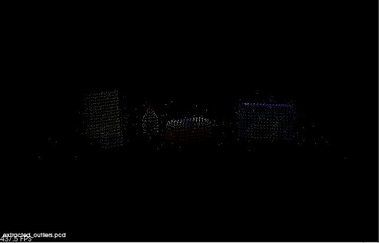
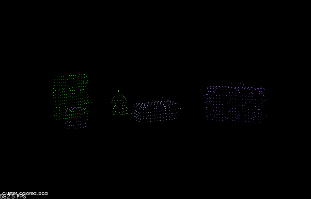
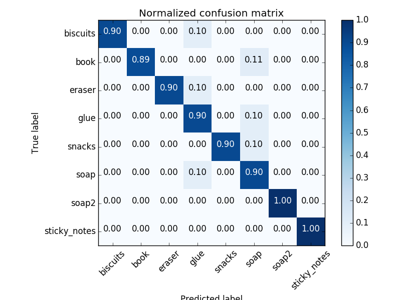
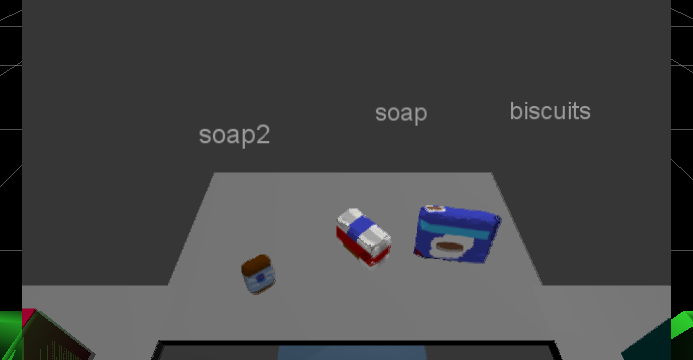
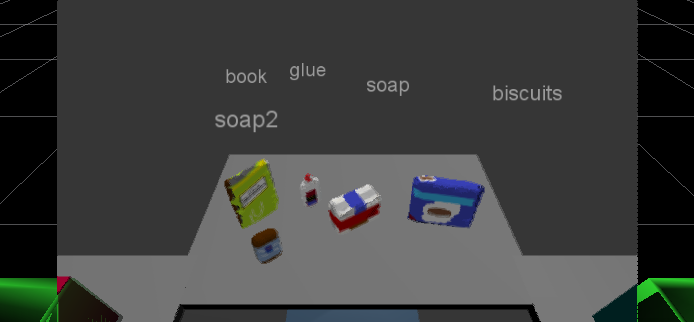
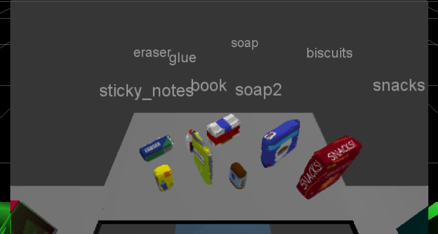

## Project: Perception Pick & Place
### Completed by Yang Dai

---

# Required Steps for a Passing Submission:
1. Extract features and train an SVM model on new objects (see `pick_list_*.yaml` in `/pr2_robot/config/` for the list of models you'll be trying to identify). 
2. Write a ROS node and subscribe to `/pr2/world/points` topic. This topic contains noisy point cloud data that you must work with.
3. Use filtering and RANSAC plane fitting to isolate the objects of interest from the rest of the scene.
4. Apply Euclidean clustering to create separate clusters for individual items.
5. Perform object recognition on these objects and assign them labels (markers in RViz).
6. Calculate the centroid (average in x, y and z) of the set of points belonging to that each object.
7. Create ROS messages containing the details of each object (name, pick_pose, etc.) and write these messages out to `.yaml` files, one for each of the 3 scenarios (`test1-3.world` in `/pr2_robot/worlds/`).  See the example `output.yaml` for details on what the output should look like.  
8. Submit a link to your GitHub repo for the project or the Python code for your perception pipeline and your output `.yaml` files (3 `.yaml` files, one for each test world).  You must have correctly identified 100% of objects from `pick_list_1.yaml` for `test1.world`, 80% of items from `pick_list_2.yaml` for `test2.world` and 75% of items from `pick_list_3.yaml` in `test3.world`.
9. Congratulations!  You're Done!

# Extra Challenges: Complete the Pick & Place
7. To create a collision map, publish a point cloud to the `/pr2/3d_map/points` topic and make sure you change the `point_cloud_topic` to `/pr2/3d_map/points` in `sensors.yaml` in the `/pr2_robot/config/` directory. This topic is read by Moveit!, which uses this point cloud input to generate a collision map, allowing the robot to plan its trajectory.  Keep in mind that later when you go to pick up an object, you must first remove it from this point cloud so it is removed from the collision map!
8. Rotate the robot to generate collision map of table sides. This can be accomplished by publishing joint angle value(in radians) to `/pr2/world_joint_controller/command`
9. Rotate the robot back to its original state.
10. Create a ROS Client for the “pick_place_routine” rosservice.  In the required steps above, you already created the messages you need to use this service. Checkout the [PickPlace.srv](https://github.com/udacity/RoboND-Perception-Project/tree/master/pr2_robot/srv) file to find out what arguments you must pass to this service.
11. If everything was done correctly, when you pass the appropriate messages to the `pick_place_routine` service, the selected arm will perform pick and place operation and display trajectory in the RViz window
12. Place all the objects from your pick list in their respective dropoff box and you have completed the challenge!
13. Looking for a bigger challenge?  Load up the `challenge.world` scenario and see if you can get your perception pipeline working there!

## [Rubric](https://review.udacity.com/#!/rubrics/1067/view) Points
 

---
### Writeup / README  
  
#### 1. Provide a Writeup / README that includes all the rubric points and how you addressed each one.  You can submit your writeup as markdown or pdf.  
  
You're reading it!  
  
### Exercise 1, 2 and 3 pipeline implemented  
#### 1. Complete Exercise 1 steps. Pipeline for filtering and RANSAC plane fitting implemented.  
In the 'pcl_callback' function, the pipeline for detecting object points was as follows:
- statistical outlier filtering (noise reduction)
- voxel grid downsampling (improve computation times)
- passthrough filter in the z-axis (isolate the on tabletop elements)
- passthrough filter in the y-axis (remove the boxes on the sides)  
- RANSAC plane segmentation (remove the remaining table points)

Several pcd files were outputted throughout this pipeline to tune the filter parameters as they required different values from exercises 1-3 to generate useful outliers.  The statistical outlier filter for noise was particularly tricky to tune as the loss of useful information (points belonging to objects) needed to be weighed against eliminating nuisance points.  'extracted_outliers.pcd' was the final output check for this stage, screenshot below:  
  
  
Some smatterings of noisy points remain, but they are mostly eliminated by the clustering in the next step.  The RANSAC plane segmentation did adversely remove points belonging to lower portions of the objects, but there are enough remaining points in each object for the classifier to work.  

#### 2. Complete Exercise 2 steps: Pipeline including clustering for segmentation implemented.  
Continuing in the 'pcl_callback' function, Euclidean clustering was implemented and tuned to separate objects from each other.  Because the objects vary drastically in size, MinClusterSize and MaxClusterSize required some tweaking to be able to detect large objects without lumping two small objects together.  'cluster_colored.pcd' was outputted at this stage to aid in tuning the segmentation parameters:
  
  
#### 2. Complete Exercise 3 Steps.  Features extracted and SVM trained.  Object recognition implemented.
Using 'capture_features.py', generated ten point clouds of each object for training. Then used 'train_svm.py' to train an SVM classifier to identify the objects.  SVM achieved a 93% average accuracy score across all objects.  
  
Scores: [ 0.875  0.75   1.     0.875  1.     1.     1.     0.75   1.     1.   ]
Accuracy: 0.93 (+/- 0.20)
accuracy score: 0.924050632911
  

  
This is a sufficiently trained classifier to meet the rubric's standards.  
  
Each identified object point cluster was fed to the classifier, and the predicted label and cluster centroids were calculated, then labels published to ROS.

World 1 RVIZ Camera View:

World 2 RVIZ Camera View:

World 3 RVIZ Camera View:

  
### Pick and Place Setup  
  
#### 1. For all three tabletop setups (`test*.world`), perform object recognition, then read in respective pick list (`pick_list_*.yaml`). Next construct the messages that would comprise a valid `PickPlace` request output them to `.yaml` format.  
In 'pr2_mover' function, the pick list was read and parsed into name and group (box) lists.  A loop cycled through the pick list names and assigned a pick pose position if the matching object name was located in the detected objects list.  If the object was not detected, pick pose defaulted to the origin so that any unidentified objects would be easily spotted in the output file.  The object group was matched to the corresponding arm using the dropbox parameters.  Then, the dictionaries of object and pick information were outputted as yaml files.  

'pick_place_routine' was disabled to speed up the yaml output as the pick & place extra challenge was not attempted.  

Roadblock: took several attempts at generating worlds 2 and 3 output yaml files before realizing the project launch code had a second line that required modification to load the correct world's pick list yaml file.  

[World 1 output](./writeup_files/output_1.yaml)
[World 2 output](./writeup_files/output_2.yaml)
[World 3 output](./writeup_files/output_3.yaml)

### Reflections

Initially, this was a copy and paste job from exercises 1-3, but in order to even see a portion of the desired objects, each filter required extensive tuning, which led to the outputting and analysis of numerous pcd files.  This was painstaking but informative, and it proves how limited the techniques used in this pipeline would be in a real world scenario, where for instance, the table height may be slightly variable.  More robust filtering techniques are needed to reduce the amount of tuning required to actually implement this type of object identification and classification.  This project required the most googling out of all the projects thus far in the nanodegree, as ROS takes some getting used to (eg. how to assign the pick position in a Pose request).  It also required a close read through 'project_template.py' to understand which functions were being called and when, so that the appropriate sections could be commented out when troubleshooting in stages.  Future work would be to implement the pick & place collision map.
